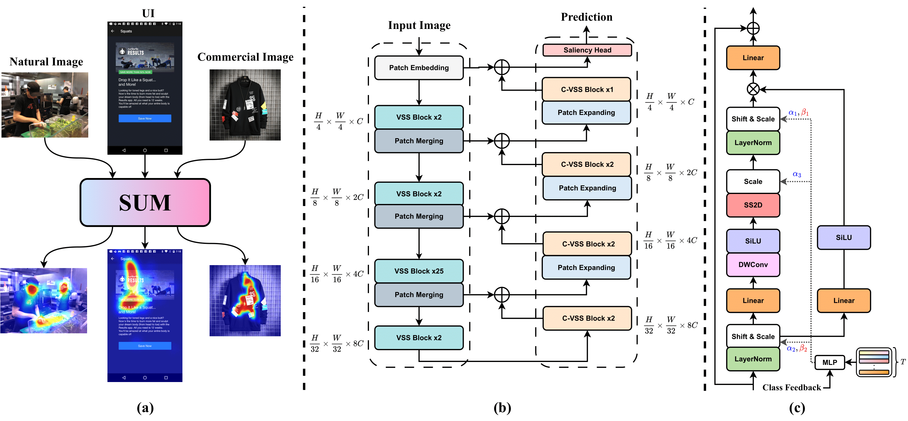

<div align="center">  </div> <br/> <div align="center"> <p> <strong>S</strong>aliency <strong>U</strong>nification through <strong>M</strong>amba for Visual Attention Modeling <br/><br/> <strong>WACV2025</strong> <br/><br/> <a href="https://arxiv.org/abs/2406.17815">Paper</a> . <a href="https://arhosseini77.github.io/sum_page/">Project Page</a> </p> </div>

<br/>
<div align="center">
   
  <a href="https://colab.research.google.com/drive/1G6bZ_knpNDo105q4rLQUPIMhP-_5bpZR?usp=sharing">
    
  </a>
</div>
<br/>

*Visual attention modeling, important for interpreting and prioritizing visual stimuli, plays a significant role in applications such as marketing, multimedia, and robotics. Traditional saliency prediction models, especially those based on Convolutional Neural Networks (CNNs) or Transformers, achieve notable success by leveraging large-scale annotated datasets. However, the current state-of-the-art (SOTA) models that use Transformers are computationally expensive. Additionally, separate models are often required for each image type, lacking a unified approach. In this paper, we propose Saliency Unification through Mamba (SUM), a novel approach that integrates the efficient long-range dependency modeling of Mamba with U-Net to provide a unified model for diverse image types. Using a novel Conditional Visual State Space (C-VSS) block, SUM dynamically adapts to various image types, including natural scenes, web pages, and commercial imagery, ensuring universal applicability across different data types. Our comprehensive evaluations across five benchmarks demonstrate that SUM seamlessly adapts to different visual characteristics and consistently outperforms existing models. These results position SUM as a versatile and powerful tool for advancing visual attention modeling, offering a robust solution universally applicable across different types of visual content.*
> [*Alireza Hosseini*](https://arhosseini77.github.io/), [*Amirhossein Kazerouni*](https://amirhossein-kz.github.io/), [*Saeed Akhavan*](https://scholar.google.com/citations?user=nuLXGJUAAAAJ&hl=en), [*Michael Brudno*](https://scholar.google.com/citations?user=xoNrEqUAAAAJ&hl=en), [*Babak Taati*](https://scholar.google.com.au/citations?user=7-X6qUUAAAAJ&hl=en)


<div align="center">
    
    <p style="font-size: small;">(a) Overview of <strong>SUM</strong> model, (b) demonstrates our conditional-U-Net-based model for saliency prediction, and (c) illustrates the proposed C-VSS module.</p>
</div>


# 💥 News 💥
- **`25.06.2024`** | Code is released!
- **`30.08.2024`** | Accepted in WACV 2025! 🥳


# Installation

Ensure you have Python >= 3.10 installed on your system. Then, install the required libraries and dependencies.

## Requirements

Install PyTorch and other necessary libraries:

```bash
pip install torch==2.1.0 torchvision==0.16.0 torchaudio==2.1.0 --index-url https://download.pytorch.org/whl/cu121
pip install -r requirements.txt
```
* If you encounter NVCC problems during installation, see: [NVCC Issue](https://github.com/Arhosseini77/SUM/issues/1).

## Pre-trained Weights

Download the **SUM** model from the provided Google Drive link and move it to the specified directory:

- [Download SUM model](https://drive.google.com/file/d/14ma_hLe8DrVNuHCSKoOz41Q-rB1Hbg6A/view?usp=drive_link): `sum_model.pth`
- Move `sum_model.pth` to: `net/pre_trained_weights`

# Usage

## Inference

To generate saliency maps, use the `inference.py` script. Here are the steps and commands:

```bash
python inference.py --img_path /path/to/your/image.jpg --condition [0, 1, 2, 3] --output_path /path/to/output --heat_map_type [HOT, Overlay]
```

### Parameters:

- `--img_path`: Path to the input image for which you want to generate the saliency map.
- `--condition`: Condition index for generating the saliency map. Each number corresponds to a specific type of visual content:
  - `0`: Natural scenes based on the Salicon dataset (Mouse data).
  - `1`: Natural scenes (Eye-tracking data).
  - `2`: E-Commercial images.
  - `3`: User Interface (UI) images.
- `--output_path`: Path to the folder where the output saliency map will be saved.
- `--heat_map_type`: Type of heatmap to generate. Choose either `HOT` for a standalone heatmap or `Overlay` to overlay the heatmap on the original image.

### Examples

Generate a standalone HOT heatmap for natural scenes images:

```bash
python inference.py --img_path input_image.jpg --condition 1 --output_path output_results --heat_map_type HOT
```

Overlay the heatmap on the original image for e-commerce images:

```bash
python inference.py --img_path input_image.jpg --condition 2 --output_path output_results --heat_map_type Overlay
```

#### Example Images


| Input                                                         | SUM                                                       |
|---------------------------------------------------------------|-----------------------------------------------------------|
|  |  |


## Training

To train the model, first download the necessary pre-trained weights and datasets:

1. **Pretrained Encoder Weights**: Download from [VMamba GitHub](https://github.com/MzeroMiko/VMamba/releases/download/%2320240218/vssmsmall_dp03_ckpt_epoch_238.pth)  or [google drive](https://drive.google.com/file/d/1zUczEDh09Sr2HtQclYwGBvTh0Gwydr52/view?usp=sharing) and move the file to `net/pre_trained_weights/vssmsmall_dp03_ckpt_epoch_238.pth`.
2. **Datasets**: Download the dataset of 7 different sets from the provided Google Drive link. This zip file contains 256x256 images of stimuli, saliency maps, fixation maps, and ID CSVs of datasets SALICON, MIT1003, CAT2000, SALECI, UEYE, and FIWI.
   - [Download datasets](https://drive.google.com/file/d/1Mdk97UB0phYDZv8zgjBayeC1I1_QcUmh/view?usp=drive_link)
   - unzip and move `datasets` directory to `./`
   
Run the training process:

```bash
python train.py
```

* If you want to run the training in Google Colab to manage resource constraints better, reduce the batch size or use the alternative script:
```bash
python train_colab.py
```
## Validation

For model validation on the dataset's validation set, download the dataset as mentioned above. then execute the validation script:

```bash
python validation.py
```

# Acknowledgment

We would like to thank the authors and contributors of [VMamba](https://github.com/MzeroMiko/VMamba), [VM-UNet](https://github.com/JCruan519/VM-UNet), and [TranSalNet](https://github.com/LJOVO/TranSalNet) for their open-sourced code which significantly aided this project.

# Citation
```bibtex
@article{hosseini2024sum,
  title={SUM: Saliency Unification through Mamba for Visual Attention Modeling},
  author={Hosseini, Alireza and Kazerouni, Amirhossein and Akhavan, Saeed and Brudno, Michael and Taati, Babak},
  journal={arXiv preprint arXiv:2406.17815},
  year={2024}
}
```
